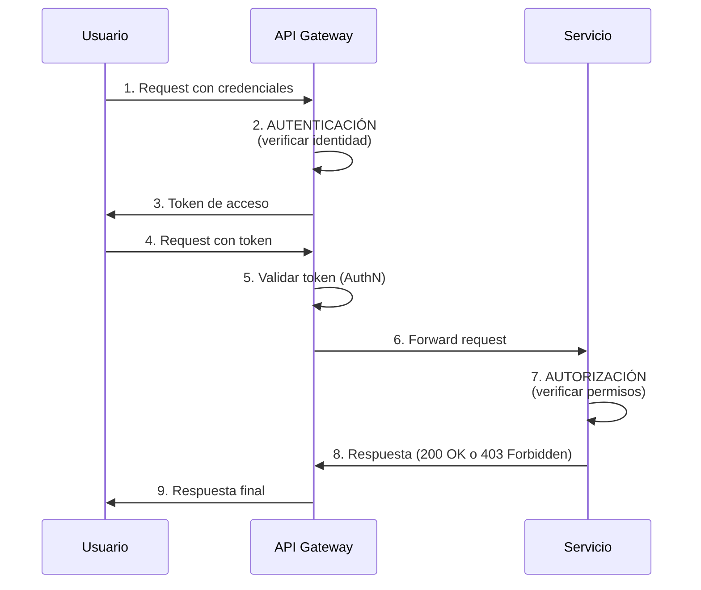

# Autenticación vs Autorización

## ¿Qué es la Autenticación (AuthN)?

**Autenticación** es el proceso de **verificar la identidad** de un usuario, sistema o entidad.

### Pregunta clave que responde:
> **"¿Quién eres?"**

### Ejemplos cotidianos:
- Ingresar usuario y contraseña en un sitio web
- Desbloquear tu teléfono con huella dactilar
- Mostrar tu DNI/pasaporte en el aeropuerto
- Usar autenticación de dos factores (2FA)

### En APIs y sistemas:
```
Usuario: "Soy juan@empresa.com"
Sistema: "Demuéstralo con tu contraseña"
Usuario: [provee contraseña]
Sistema: ✅ "Confirmado, eres juan@empresa.com"
```

---

## ¿Qué es la Autorización (AuthZ)?

**Autorización** es el proceso de **determinar qué puede hacer** un usuario autenticado.

### Pregunta clave que responde:
> **"¿Qué puedes hacer?"**

### Ejemplos cotidianos:
- Tener acceso a la sala VIP del aeropuerto (solo si tienes tarjeta platinum)
- Ver contenido premium de Netflix (solo si pagas la suscripción)
- Editar un documento compartido (solo si el dueño te dio permisos)

### En APIs y sistemas:
```
Usuario autenticado: juan@empresa.com
Sistema: "Eres Juan, ¿pero puedes eliminar este proyecto?"
Sistema: [verifica roles/permisos]
Sistema: ✅ "Sí, tienes el rol 'Admin'" → PERMITIDO
Sistema: ❌ "No, solo eres 'Developer'" → DENEGADO
```

---

## Diferencias Clave

| Aspecto | Autenticación (AuthN) | Autorización (AuthZ) |
|---------|----------------------|---------------------|
| **Pregunta** | ¿Quién eres? | ¿Qué puedes hacer? |
| **Proceso** | Verificación de identidad | Verificación de permisos |
| **Cuándo ocurre** | Al inicio de la sesión/request | En cada acción/recurso |
| **Información usada** | Credenciales (user/pass, tokens, biometría) | Roles, permisos, políticas |
| **Resultado** | Usuario identificado | Acción permitida/denegada |
| **Ejemplo** | Login con usuario y contraseña | "Admin puede eliminar usuarios" |

---

## Flujo Típico en una API



### Explicación del flujo:

1. **Pasos 1-3**: **Autenticación**
   - Usuario provee credenciales
   - Sistema verifica identidad
   - Emite token de acceso

2. **Paso 5**: **Re-autenticación** (validación de token)
   - El gateway verifica que el token es válido
   - Confirma que el usuario sigue siendo quien dice ser

3. **Paso 7**: **Autorización**
   - El servicio verifica si el usuario tiene permisos
   - Decide si permitir o denegar la acción

---

## Separación de Responsabilidades

### ✅ Buenas prácticas:

**Autenticación centralizada:**
- Identity Provider (IdP) como Keycloak, Auth0, Okta
- API Gateway valida tokens
- Una sola fuente de verdad para identidades

**Autorización distribuida:**
- Gateway hace autorización básica (¿token válido? ¿scopes mínimos?)
- Servicios hacen autorización fina (¿puede este usuario editar ESTE recurso?)

### ❌ Anti-patrones:

```csharp
// ❌ MAL: Mezclar autenticación y lógica de negocio
public IActionResult DeleteProject(int projectId, string username, string password)
{
    // NO hagas esto - autenticación debería estar en middleware/gateway
    if (!ValidatePassword(username, password))
        return Unauthorized();
    
    // Lógica de negocio mezclada con auth
    var project = _db.Projects.Find(projectId);
    if (project.OwnerId != GetUserId(username))
        return Forbidden();
    
    _db.Projects.Remove(project);
    return Ok();
}

// ✅ BIEN: Usuario ya autenticado, solo validamos autorización
[Authorize] // Autenticación hecha por middleware
public IActionResult DeleteProject(int projectId)
{
    var userId = User.FindFirst(ClaimTypes.NameIdentifier).Value;
    
    // Solo lógica de autorización
    var project = _db.Projects.Find(projectId);
    if (project.OwnerId != userId && !User.IsInRole("Admin"))
        return Forbid();
    
    _db.Projects.Remove(project);
    return Ok();
}
```

---

## Errores de Código HTTP

| Código | Significado | Cuándo usarlo |
|--------|-------------|---------------|
| **401 Unauthorized** | No autenticado | Token inválido, expirado o ausente |
| **403 Forbidden** | No autorizado | Usuario autenticado pero sin permisos |

**Ejemplo:**
```
GET /api/admin/users
Sin token → 401 Unauthorized
Con token de usuario normal → 403 Forbidden
Con token de admin → 200 OK
```

---

## Casos Prácticos

### Caso 1. Sistema bancario online
- **AuthN**: Login con usuario + contraseña + SMS 2FA
- **AuthZ**: Solo puedes transferir desde TUS cuentas, no las de otros

### Caso 2: API de microservicios
- **AuthN**: Servicio A presenta certificado mTLS o token JWT
- **AuthZ**: Servicio A solo puede leer datos de clientes, no modificarlos

### Caso 3: Aplicación móvil
- **AuthN**: Login con OAuth2 (Authorization Code + PKCE)
- **AuthZ**: Scope `read:profile` permite ver perfil, `write:profile` permite editarlo

---

## Resumen

🔑 **Autenticación** = **Identidad** = "¿Quién eres?"

🔐 **Autorización** = **Permisos** = "¿Qué puedes hacer?"

> **Primero autenticamos, luego autorizamos**. Siempre en ese orden.

---

## Ejercicio Práctico

Identifica en los siguientes escenarios si es **AuthN** o **AuthZ**:

1. Un usuario ingresa su email y contraseña ➜ **_________**
2. El sistema verifica si el usuario puede eliminar un comentario ➜ **_________**
3. Se valida un token JWT en el API Gateway ➜ **_________**
4. Un admin accede al panel de administración ➜ **_________** (ambos, primero AuthN para verificar identidad de admin, luego AuthZ para verificar rol)
5. Se rechaza una petición con 403 Forbidden ➜ **_________**

<details>
<summary>Ver respuestas</summary>

1. AuthN
2. AuthZ
3. AuthN
4. Ambos (AuthN + AuthZ)
5. AuthZ (ya estaba autenticado, pero no autorizado)
</details>

---

[⬅️ Volver al índice del bloque](./README.md) | [Siguiente: Identidad Digital ➡️](./02-identidad-digital.md)
