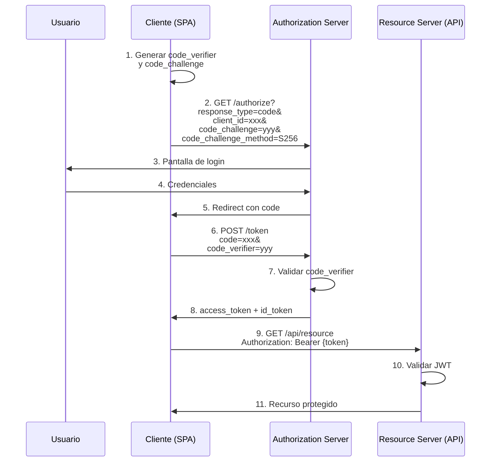

# Bloque 2 — Protocolos y Formatos (OAuth2, OIDC, JWT)

## Objetivos del Bloque

Comprender cómo funcionan OAuth2 y OpenID Connect en la práctica, dominar la estructura y validación de JWT, y aplicar las mejores prácticas de seguridad en la implementación de flujos de autenticación.

## Duración estimada

8-10 horas

---

## Contenido

### 1. [Introducción a OAuth 2.0](./01-oauth2-intro.md)

- Qué es OAuth 2.0 y qué problemas resuelve
- Roles: Resource Owner, Client, Authorization Server, Resource Server
- Flujo conceptual básico

### 2. [OAuth 2.0 Grants (Flujos)](./02-oauth2-grants.md)

- **Authorization Code** (el más común y seguro)
- **Authorization Code + PKCE** (para SPAs y móviles)
- **Client Credentials** (machine-to-machine)
- **Resource Owner Password** ⚠️ (obsoleto, evitar)
- **Implicit** ⚠️ (obsoleto, NO usar)
- Refresh Token flow

### 3. [OpenID Connect (OIDC)](./03-openid-connect.md)

- OIDC como capa sobre OAuth2
- ID Token vs Access Token
- UserInfo endpoint
- Claims estándar

### 4. [JSON Web Tokens (JWT)](./04-jwt.md)

- Estructura: Header, Payload, Signature
- Algoritmos de firma: RS256, HS256, ES256
- Claims estándar: `iss`, `aud`, `exp`, `nbf`, `sub`, `iat`
- Validación de tokens
- JWK y JWKS

### 5. [Token Introspection y Revocation](./05-introspection-revocation.md)

- Introspection endpoint
- Revocation endpoint
- Tokens opacos vs JWT
- Estrategias de revocación

### 6. [Seguridad en OAuth2/OIDC](./06-seguridad.md)

- PKCE y por qué es obligatorio
- State parameter (CSRF protection)
- Nonce (replay attack protection)
- CORS y SameSite cookies
- Almacenamiento seguro de tokens
- ⚠️ NO usar localStorage para tokens sensibles

---

## Actividades Prácticas

### Lab 1. Configurar Identity Provider

📝 [Ver lab completo](./labs/lab-1-setup-idp.md)

Configurar Keycloak o Auth0:

- Crear realm/tenant
- Crear client application
- Configurar scopes y claims

### Lab 2: Implementar Authorization Code + PKCE

📝 [Ver lab completo](./labs/lab-2-auth-code-pkce.md)

Implementar flujo completo en una SPA:

- Generar code_verifier y code_challenge
- Redirect a authorization endpoint
- Intercambiar código por tokens
- Decodificar y validar JWT

### Lab 3: Validación de JWT

📝 [Ver lab completo](./labs/lab-3-jwt-validation.md)

Implementar validación completa:

- Verificar firma con clave pública
- Validar claims (`iss`, `aud`, `exp`)
- Consumir JWKS endpoint
- Manejo de rotación de claves

---

## Diagramas

### Flujo Authorization Code + PKCE

---

## Recursos Adicionales

- 📄 [Especificaciones RFC](./recursos/rfcs.md)
  - RFC 6749: OAuth 2.0
  - RFC 7519: JWT
  - RFC 7636: PKCE
  - RFC 8414: OAuth 2.0 Authorization Server Metadata
- 📚 [Herramientas útiles](./recursos/herramientas.md)
  - jwt.io - Decodificar JWT
  - oauth.tools - Playground OAuth2
  - Postman - Probar flujos
- 🔒 [Checklist de seguridad](./recursos/security-checklist.md)

---

## Evaluación

Al completar este bloque deberías poder:

- [ ] Explicar los diferentes OAuth2 grants y cuándo usar cada uno
- [ ] Implementar Authorization Code + PKCE de principio a fin
- [ ] Decodificar y validar un JWT manualmente
- [ ] Configurar un IdP (Keycloak/Auth0) para diferentes tipos de aplicaciones
- [ ] Identificar vulnerabilidades comunes en implementaciones OAuth2
- [ ] Implementar validación de tokens con JWKS

---

[⬅️ Bloque anterior: Fundamentos](../bloque-1-fundamentos/README.md) | [Volver al índice principal](../../README.md) | [Siguiente: Bloque 3 - Diseño ➡️](../bloque-3-diseno-microservicios/README.md)
